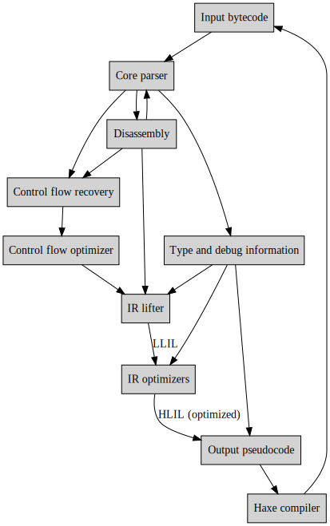

# crashlink


Pure Python HashLink bytecode parser/disassembler/decompiler/modding tool

## Features

- Pure Python with zero dependencies, integrates nicely in a lot of places (IDAPython compatible!)
- Allows values to be externally modified and reserialised through a scriptable interface
- A very nice little CLI with [hlbc](https://github.com/Gui-Yom/hlbc)-compatible mode.

## Installation

```bash
pip install crashlink # TODO: publish to PyPI
```

Optionally, install `tqdm` for progress bars when parsing large files:

```bash
pip install crashlink[tqdm]
```

You also need to have Graphviz installed to generate control flow graphs. On most *nix systems, on Windows (with Chocolatey or Scoop), and on MacOS (with Homebrew), you can install it with your package manager under `graphviz`.

- Windows: `choco install graphviz`
- MacOS: `brew install graphviz`
- Debian: `sudo apt install graphviz`
- Arch: `sudo pacman -S graphviz`
- Fedora: `sudo dnf install graphviz`

## Usage

Either:

```py
from crashlink import *
code = Bytecode.from_path("path/to/file.hl")
for func in code.functions:
    if func.findex.value == 22 or func.findex.value == 240: # typical entry points that the compiler generates
        print(disasm.func(code, func))
# > f@22 static $Clazz.main () -> Void (from Clazz.hx)
# > Reg types:
# >   0. Void
# >
# > Ops:
# >   0. Ret             {'ret': 0}                                       return
```

Or:

```bash
$ crashlink path/to/file.hl # or python -m crashlink
crashlink> funcs
f@22 static Clazz.main () -> Void (from Clazz.hx)
f@23 Clazz.method (Clazz) -> I32 (from Clazz.hx)
crashlink> fn 22
f@22 static Clazz.main () -> Void (from Clazz.hx)
Reg types:
  0. Void

Ops:
  0. Ret             {'ret': 0}                                       return
```

## Development

For development purposes, you can clone the repo, install development dependencies, and run the tests:

```bash
git clone https://github.com/N3rdL0rd/crashlink
cd crashlink
pip install -e .[dev]
pytest
```

Before committing, please run `./gen_docs` to format the code, run tests, and generate documentation in `docs/`. If you're adding new features to the core serialisation/deserialisation code (`core.py`), please also add a test case in `tests/haxe/` for the new language feature you're adding. If you're adding a feature to the decompiler or disassembler, please add a normal test case (in Python) in `tests/` that tests the new feature.

Pull requests are always welcome! For major changes, please open an issue first to discuss what you would like to change.

## Architecture



## Credits

- Thank you to [Gui-Yom](https://github.com/Gui-Yom) for writing hlbc and for maintaining documentation on the HashLink bytecode format, as well as for providing tests and helping me during development.
- Thank you to [Haxe Foundation](https://haxe.org/) for creating the HashLink VM and the Haxe programming language.
- And a big thank you to you, dear user, for being at least partially interested in this project.

:heart: N3rdL0rd
