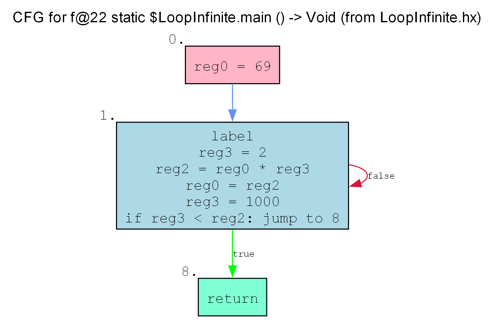

# Decompilation Notes

## Introduction

This document contains notes on what code patterns compile to in the HashLink bytecode. It is intended to be a reference both for the implementation of the crashlink decompiler and for anyone interested in reading and understanding HL opcodes.

## Registers

A register is a strictly typed single slot for data at runtime. Every function has a list of registers that it uses to store data - they store every value that is used in the function as a local. Register names can be inferred by the `assigns` debug field, which stores opcode indexes that correspond to assigning a variable.

## If Statements

Sample: `tests/haxe/If.hx`

In the case of an empty if statement:

```hx
var a = 500;
if (a > 400) {
    
}
```

The following is generated:


Presumably to avoid implementing additional logic for empty if statements, the result of the condition is always stored in a register, even if it is not used. This only applies to if statements with empty bodies.

As for any other programming language's control flow graphs, if statements make a sort of "diamond" shape in the bytecode - the conditional jump splits the flow into two paths, and at some point they merge back together to one node. crashlink uses a simple approach of following the two control flow paths and finding where they merge to generate IR if conditional blocks.

## Loops

Sample: `tests/haxe/LoopInfinite.hx`

This sample is a simple infinite loop with a break statement:

```hx
class LoopInfinite {
    static function main() {
        var b = 69;
        while (true) {
            b *= 2;
            if (b > 1000) {
                break;
            }
        }
    }
}
```



Notably, all loops in HashLink start with a `Label` opcode. It's not entirely known why this is the case, but it's incredibly useful to us as it allows us to easily identify loops, since the `Label` opcode is only used at the beginning of a loop and is not generated anywhere else by the Haxe compiler.

> [!WARNING]
> Although HashLink is a Haxe-only bytecode target and the Haxe compiler is the only compiler that generates HashLink bytecode, it is not guaranteed that the `Label` opcode will always be at the beginning of a loop - and if other languages start targeting HashLink, this assumption may no longer hold true. Long-term, it would always be best to use the CFG to identify loops more robustly.
