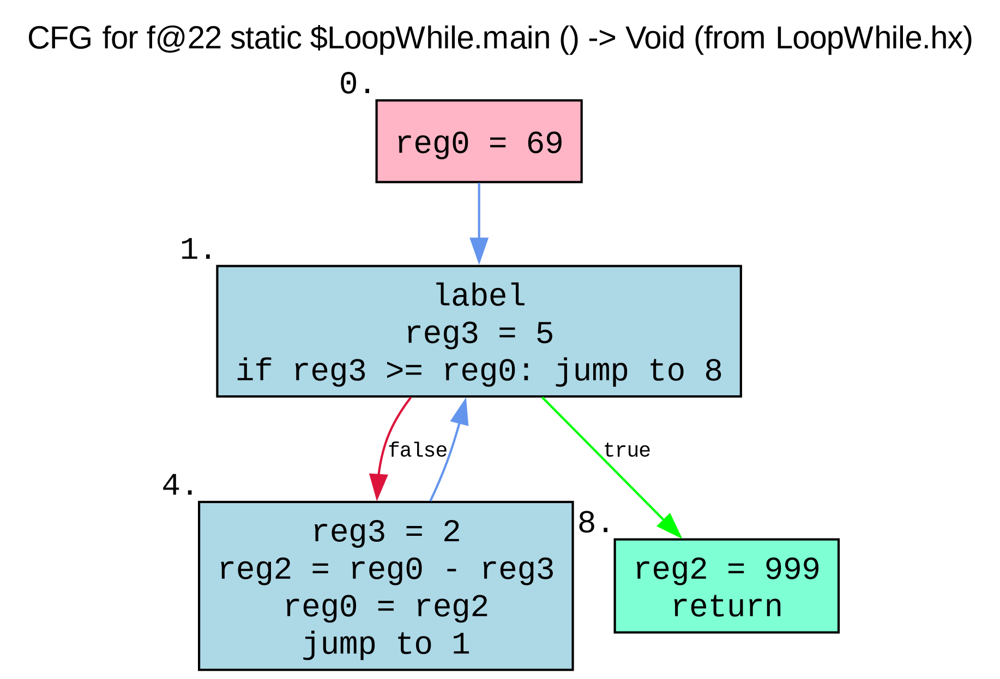

# Decompilation Notes

## Introduction

This document contains notes on what code patterns compile to in the HashLink bytecode. It is intended to be a reference both for the implementation of the crashlink decompiler and for anyone interested in reading and understanding HL opcodes.

## Registers

A register is a strictly typed single slot for data at runtime. Every function has a list of registers that it uses to store data - they store every value that is used in the function as a local. Register names can be inferred by the `assigns` debug field, which stores opcode indexes that correspond to assigning a variable. Sometimes, `assigns` will contain negative opcode indices - this means that the variable names being referred to are arguments. If a function is not static, then the first argument will always be `this`, and there will be no corresponding assignment for it.

## If Statements

Sample: `tests/haxe/If.hx`

In the case of an empty if statement:

```hx
var a = 500;
if (a > 400) {
    
}
```

The following is generated:


Presumably to avoid implementing additional logic for empty if statements, the result of the condition is always stored in a register, even if it is not used. This only applies to if statements with empty bodies. Note that `reg2` is `Void` here, just discarding the result.

As for any other programming language's control flow graphs, if statements make a sort of "diamond" shape in the bytecode - the conditional jump splits the flow into two paths, and at some point they merge back together to one node. crashlink uses a simple approach of following the two control flow paths and finding where they merge to generate IR if conditional blocks.

## Loops

Sample: `tests/haxe/LoopWhile.hx`

This sample is a simple while loop:



Notably, all loops in HashLink start with a `Label` opcode. It's not entirely known why this is the case, but it's incredibly useful to us as it allows us to easily identify loops, since the `Label` opcode is only used at the beginning of a loop and is not generated anywhere else by the Haxe compiler.

> [!WARNING]
> Although HashLink is a Haxe-only bytecode target and the Haxe compiler is the only compiler that generates HashLink bytecode, it is not guaranteed that the `Label` opcode will always be at the beginning of a loop - and if other languages start targeting HashLink, this assumption may no longer hold true. Long-term, it would always be best to use the CFG to identify loops more robustly.

See that warning right above this sentence? crashlink ignores it (YOLO)! crashlink handles loops by following these simple steps:

- Look for `Label` opcodes
- Once one is encountered, perform an isolated abstract lift to IR for the current block (the condition)
- Find all other paths down the CFG that will jump back up to this Label
- Lift all nodes in these paths to IR

And just like that, we can handle a basic loop with no optimizations!

```txt
crashlink> ir 22
<IRBlock:
[<IRAssign: <IRLocal: b I32> = <IRConst: 69> (I32)>,
        <IRBlock:
        [<IRPrimitiveLoop: cond -> <IRBlock:
                [<IRAssign: <IRLocal: reg3 I32> = <IRConst: 5> (I32)>,
                        <IRPrimitiveJump: <Opcode: JSGte {'a': 3, 'b': 0, 'offset': 4}>>]>
                 body -> <IRBlock:
                [<IRAssign: <IRLocal: reg3 I32> = <IRConst: 2> (I32)>,
                        <IRAssign: <IRLocal: b I32> = <IRArithmetic: <IRLocal: b I32> - <IRLocal: reg3 I32>> (I32)>,
                        <IRAssign: <IRLocal: b I32> = <IRLocal: b I32> (I32)>,
                        <IRBlock>]>>]>]>
```
