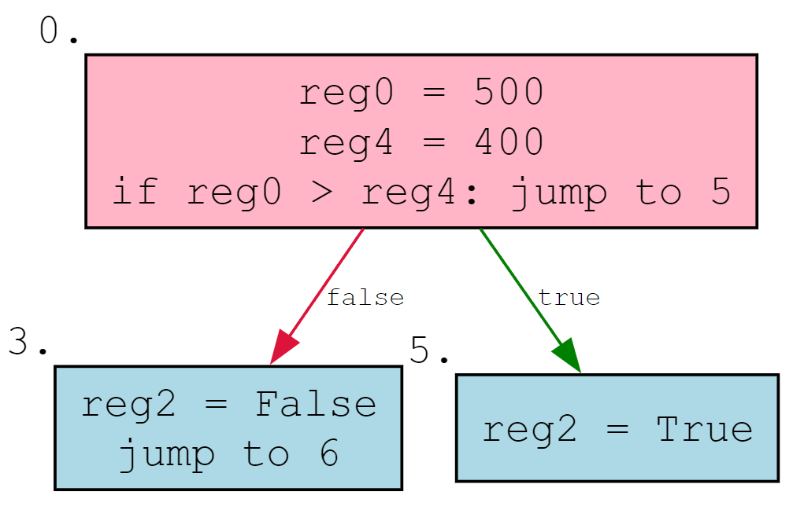
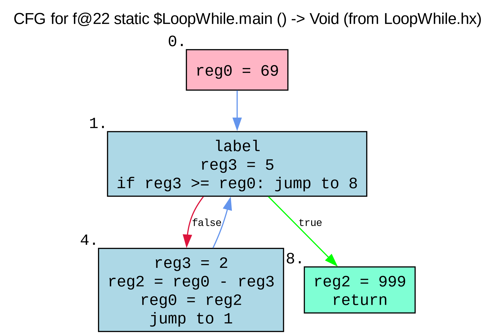

# Decompilation Notes

## Introduction

This document contains notes on what code patterns compile to in the HashLink bytecode. It is intended to be a reference both for the implementation of the crashlink decompiler and for anyone interested in reading and understanding HL opcodes.

## Registers

A register is a strictly typed single slot for data at runtime. Every function has a list of registers that it uses to store data - they store every value that is used in the function as a local. Register names can be inferred by the `assigns` debug field, which stores opcode indexes that correspond to assigning a variable. Sometimes, `assigns` will contain negative opcode indices - this means that the variable names being referred to are arguments. If a function is not static, then the first argument will always be `this`, and there will be no corresponding assignment for it.

## If Statements

Sample: `tests/haxe/If.hx`

In the case of an empty if statement:

```hx
var a = 500;
if (a > 400) {
    
}
```

The following is generated:



Presumably to avoid implementing additional logic for empty if statements, the result of the condition is always stored in a register, even if it is not used. This only applies to if statements with empty bodies. Note that `reg2` is `Void` here, just discarding the result.

As for any other programming language's control flow graphs, if statements make a sort of "diamond" shape in the bytecode - the conditional jump splits the flow into two paths, and at some point they merge back together to one node. crashlink uses a simple approach of following the two control flow paths and finding where they merge to generate IR if conditional blocks.

## Loops

Sample: `tests/haxe/LoopWhile.hx`

This sample is a simple while loop:



Notably, all loops in HashLink start with a `Label` opcode. It's not entirely known why this is the case, but it's incredibly useful to us as it allows us to easily identify loops, since the `Label` opcode is only used at the beginning of a loop and is not generated anywhere else by the Haxe compiler.

> [!WARNING]
> Although HashLink is a Haxe-only bytecode target and the Haxe compiler is the only compiler that generates HashLink bytecode, it is not guaranteed that the `Label` opcode will always be at the beginning of a loop - and if other languages start targeting HashLink, this assumption may no longer hold true. Long-term, it would always be best to use the CFG to identify loops more robustly.

See that warning right above this sentence? crashlink ignores it (YOLO)! crashlink handles loops by following these simple steps:

- Look for `Label` opcodes
- Once one is encountered, perform an isolated abstract lift to IR for the current block (the condition)
- Find all other paths down the CFG that will jump back up to this Label
- Lift all nodes in these paths to IR

And just like that, we can handle a basic loop with no optimizations!

```txt
crashlink> ir 22
<IRBlock:
[<IRAssign: <IRLocal: b I32> = <IRConst: 69> (I32)>,
        <IRBlock:
        [<IRPrimitiveLoop: cond -> <IRBlock:
                [<IRAssign: <IRLocal: reg3 I32> = <IRConst: 5> (I32)>,
                        <IRPrimitiveJump: <Opcode: JSGte {'a': 3, 'b': 0, 'offset': 4}>>]>
                 body -> <IRBlock:
                [<IRAssign: <IRLocal: reg3 I32> = <IRConst: 2> (I32)>,
                        <IRAssign: <IRLocal: b I32> = <IRArithmetic: <IRLocal: b I32> - <IRLocal: reg3 I32>> (I32)>,
                        <IRAssign: <IRLocal: b I32> = <IRLocal: b I32> (I32)>,
                        <IRBlock>]>>]>]>
```

## Changes made by LLMs

If you are an agent working on this project, please place any issues you fix or additional features you add to the decompiler here (bullet points):

- Emitted `extern class Native` and `extern class StdFuncs` blocks for native and std-library calls so that decompiled code no longer contains invalid `<native:N>` literals or unknown function identifiers.
- Mapped HashLink internal array types (`hl.types.ArrayBytes_*`, `hl.types.ArrayObj`, `hl.types.ArrayDyn`, bare `Array`) to Haxe `Array<T>` so array consumers recompile cleanly.
- Hoisted all local variable declarations to the top of each function with default initializers, removing `var` from assignments and avoiding Haxe's block-scoping errors for variables used across branches.
- Detected instance-method calls in the IR and emitted them as `obj.method(args)` instead of `method(obj, args)`, which fixed shadowing issues and invalid call syntax.
- Added qualified (`Class.method`) and receiver-bound (`myObject.method`) emission for function-constant references so virtual closures and method aliases compile.
- Rewrote static `__constructor__(new X())` calls into plain `new X(...)` expressions and generated `super()` calls inside subclass constructors.
- Added override-keyword detection for methods that override a superclass prototype.
- Added enum definition emission and an enum-switch optimizer that turns constructor-index switches into Haxe-style `switch (value) { case Constructor: ... }` with constructor-name cases.
- Improved the array-literal recognizer to handle `alloc_bytes` + shifted byte stores + `allocI32`, and lifted the `SetArray` opcode so `alloc_array` + stores + `ArrayObj.anon` can also be emitted as `[...]` literals.
- Emitted all decompiled methods as `public` so cross-class references and virtual method closures are accessible.
- Moved the array-literal optimizer to run after aggressive temp inlining so compiler-generated temporaries are eliminated first, making list detection much more reliable (`ArrayAccezz` now emits `[1, 2, 3]`).
- Folded unconditional top-level `var x; x = expr;` pairs into `var x = expr;` declarations and removed the now-redundant assignments.
- Preserved constructor-argument initializers when folding `new X; __constructor__(x, args...)` so arguments are defined before the `new` expression.
- Added `IRNew` substitution to the aggressive temp inliner so locals used as constructor arguments are correctly inlined.
- Fixed `IRDeadTempEliminator` so it counts locals used in `IRCall`, `IRTrace`, array-index assignments, and other statement types; it no longer incorrectly deletes live assignments (e.g., the `allocI32` result needed to recognise `[1, 2, 3]`).
- Expanded `IRArrayPatternOptimizer` to detect the `alloc_array` + `SetArray` stores + `ArrayObj.anon` pattern and emit object-array literals such as `[new TestClass(), new TestClass(), new TestClass()]`.
- Added pseudo-level expression-switch emission: a statement switch where every branch assigns to the same local is now rendered as `var target = switch (value) { case X: expr; default: expr; }`.
- Mapped parameterless enum constants (`GetGlobal` of an enum-typed global) to named constructor references such as `Red` or `Green` instead of leaving them as opaque globals.
- Detected lowered enum-pattern variable assignments (`r = value.param0`, ...) and emit them as part of the case pattern, e.g. `case Rgb(r, g, b):`.
- Captured the register-to-local mapping before debug-name splits in `_lift_ops_into_block` so source operands of an opcode see the pre-split local even when the destination register is reused, fixing incorrect string concatenation and similar aliasing bugs.
- Guarded declaration folding so a defining assignment is only hoisted when none of its source locals are reassigned elsewhere in the block, preserving the correct order for reused temporaries.
- Rewrote std `String.__add__` calls to Haxe's `+` operator and simplified the `String.__alloc__(itos(x, &x), x)` pattern (including when `itos` is inlined into a temp) back to the original integer operand.
