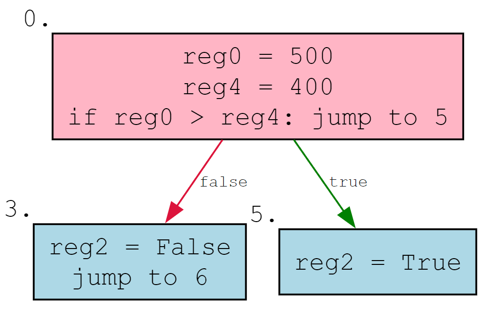
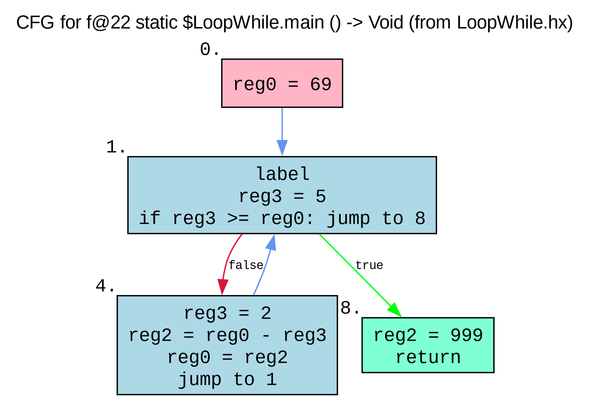

# Decompilation Notes

## Introduction

This document contains notes on what code patterns compile to in the HashLink bytecode. It is intended to be a reference both for the implementation of the crashlink decompiler and for anyone interested in reading and understanding HL opcodes.

## Registers

A register is a strictly typed single slot for data at runtime. Every function has a list of registers that it uses to store data - they store every value that is used in the function as a local. Register names can be inferred by the `assigns` debug field, which stores opcode indexes that correspond to assigning a variable. Sometimes, `assigns` will contain negative opcode indices - this means that the variable names being referred to are arguments. If a function is not static, then the first argument will always be `this`, and there will be no corresponding assignment for it.

## If Statements

Sample: `tests/haxe/If.hx`

In the case of an empty if statement:

```hx
var a = 500;
if (a > 400) {
    
}
```

The following is generated:



Presumably to avoid implementing additional logic for empty if statements, the result of the condition is always stored in a register, even if it is not used. This only applies to if statements with empty bodies. Note that `reg2` is `Void` here, just discarding the result.

As for any other programming language's control flow graphs, if statements make a sort of "diamond" shape in the bytecode - the conditional jump splits the flow into two paths, and at some point they merge back together to one node. crashlink uses a simple approach of following the two control flow paths and finding where they merge to generate IR if conditional blocks.

## Loops

Sample: `tests/haxe/LoopWhile.hx`

This sample is a simple while loop:



Notably, all loops in HashLink start with a `Label` opcode. It's not entirely known why this is the case, but it's incredibly useful to us as it allows us to easily identify loops, since the `Label` opcode is only used at the beginning of a loop and is not generated anywhere else by the Haxe compiler.

> [!NOTE]
> The reason for `Label` is now understood: it's a **JIT requirement**, not (just) a compiler convenience. The JIT's register allocator caches vreg values in CPU registers while emitting code linearly; a back-edge into a loop head would use those stale cached registers for the next iteration. `OLabel` calls `discard_regs(ctx, false)`, forcing the allocator to reload vregs from their stack slots. A hand-written loop with a back-edge and no `Label` at its head is **silently miscompiled** — loop variables keep values clobbered by the previous iteration's body. If you emit loops in hand-written bytecode, always put a `Label` at the loop head.

> [!WARNING]
> Although HashLink is a Haxe-only bytecode target and the Haxe compiler is the only compiler that generates HashLink bytecode, it is not guaranteed that the `Label` opcode will always be at the beginning of a loop - and if other languages start targeting HashLink, this assumption may no longer hold true. Long-term, it would always be best to use the CFG to identify loops more robustly.

See that warning right above this sentence? crashlink ignores it (YOLO)! crashlink handles loops by following these simple steps:

- Look for `Label` opcodes
- Once one is encountered, perform an isolated abstract lift to IR for the current block (the condition)
- Find all other paths down the CFG that will jump back up to this Label
- Lift all nodes in these paths to IR

And just like that, we can handle a basic loop with no optimizations!

```txt
crashlink> ir 22
<IRBlock:
[<IRAssign: <IRLocal: b I32> = <IRConst: 69> (I32)>,
        <IRBlock:
        [<IRPrimitiveLoop: cond -> <IRBlock:
                [<IRAssign: <IRLocal: reg3 I32> = <IRConst: 5> (I32)>,
                        <IRPrimitiveJump: <Opcode: JSGte {'a': 3, 'b': 0, 'offset': 4}>>]>
                 body -> <IRBlock:
                [<IRAssign: <IRLocal: reg3 I32> = <IRConst: 2> (I32)>,
                        <IRAssign: <IRLocal: b I32> = <IRArithmetic: <IRLocal: b I32> - <IRLocal: reg3 I32>> (I32)>,
                        <IRAssign: <IRLocal: b I32> = <IRLocal: b I32> (I32)>,
                        <IRBlock>]>>]>]>
```

## The `Asm` opcode and inline x86

HashLink bytecode has an opcode that almost no compiler output contains: **`Asm`**
(opcode 100). It lets a `.hl` function emit *raw x86 machine code* directly into the
JIT's instruction stream. HashLink has no bytecode verifier and JITs everything into
**RWX memory**, so this is a fully supported arbitrary-native-code primitive that no
HL-level decompiler (including crashlink) can see through — it disassembles as an
opaque list of `Asm` ops.

`Asm` has three operands: `Asm mode, value, reg`. The mode decides what the JIT does
with it (see `src/jit.c` in the hashlink repo):

| Mode | Name | Effect |
|---|---|---|
| 0 | byte output | Emit `value` as one raw byte into the code buffer at the current position. |
| 1 | scratch CPU reg | Mark CPU register `value` as clobbered in the JIT's register allocator. |
| 2 | read VM reg | Copy VM register `reg - 1`'s value **into** CPU register `value` (reads args). |
| 3 | write VM reg | Copy CPU register `value` **into** VM register `reg - 1` (writes results). |
| 4 | naked | **Reset the code buffer back to the function's entry point**, erasing the prologue the JIT already emitted. Must be the *first* opcode, and the function must have *no local variables* (args included, unless they arrive on the stack). |

### Naked functions

The useful combination is **mode 4 followed by mode-0 bytes**: the function's whole
body becomes your raw machine code.

Rules (enforced by `hl_fatal` at JIT time):

- The `Asm` mode-4 op must be the first opcode of the function.
- `totalRegsSize` must be 0, so declare **no `.regs`** and give the function **no
  register-passed arguments**. On Linux/macOS (SysV AMD64) HL passes up to 6
  integer args in `RDI, RSI, RDX, RCX, R8, R9` and floats in `XMM0..5`, so any
  argument lands in the local frame and trips the check; on Windows x64 all args
  arrive on the stack and don't count against `totalRegsSize`.
- There is no prologue/epilogue. You are entered with a bare return address on the
  stack. Don't touch `RSP`/`RBP` unless you know what you're doing, keep the stack
  balanced, and end with a `ret` (0xC3) you emitted yourself.
- Return values follow the C ABI: integers/pointers in `RAX`, floats in `XMM0`.
  `Bytes`/`String`/objects are just pointers, so returning `RAX` works for them.
- All caller-saved registers are yours to clobber (the JIT assumes calls clobber
  them). Avoid `RBX`, `R12`-`R15` unless you save/restore them.

Because JIT pages are mapped `PROT_READ | PROT_WRITE | PROT_EXEC` (`src/gc.c`),
the emitted code can **modify itself at runtime** — e.g. keep state in bytes that
follow the `ret`, increment immediates in its own instructions, or decrypt a later
part of the function on first entry.

### Writing `Asm` code in `.hlasm`

crashlink's assembler has three pseudo-ops plus a mnemonic layer (requires the
optional `keystone-engine` dependency: `pip install crashlink[extras]`):

```text
.f@1
    .returns t@1        # Bytes
    .regs               # MUST be empty for a naked function
    .ops
        AsmNaked        # Asm mode 4: erase the prologue, we're naked now
        X86 lea rcx, [rip+cnt]
        X86 inc dword [rcx]
        X86 mov eax, [rcx]
        X86 ret
cnt:
        X86 dd 0        # data: 4 zero bytes living in the code stream

        AsmByte 0x90    # raw byte, if you want to be explicit
        Asm 0, 144, reg0  # ...which is exactly equivalent to this
```

- `AsmNaked` — emits `Asm 4, 0, reg0`.
- `AsmByte <v>` — emits a single raw byte (`Asm 0, <v>, reg0`).
- `X86 <line>` — one line of x86-64 assembly, assembled with
  [keystone-engine](https://www.keystone-engine.org/) (Intel syntax). Consecutive
  `X86` lines form one block.
- `name:` — a label inside an `X86` block. Labels work in branches
  (`jnz my_loop`) and in RIP-relative operands (`[rip+my_data]`), including simple
  arithmetic (`[rip+buf+24]`). Branches and displacements are resolved for you.
- Data directives inside an `X86` block: `db 1, 2, 3`, `dd 0`, `dq 0x1122`,
  `times 26 db 0`. Data placed after a `ret` is never executed but lives in the
  same RWX page — perfect for self-modifying state.
- Anything keystone accepts works, with two syntax notes: write operand sizes as
  `dword [rcx]` or `dword ptr [rcx]` (both fine), and keystone 0.9.2 rejects the
  NASM directives `dd`/`times` — which is why crashlink implements those itself.

Under the hood every assembled byte becomes one `Asm 0, <byte>, reg0` opcode, so
the resulting `.hl` file is 100% valid HashLink bytecode that any stock `hl`
runtime will execute.

### Worked example: a self-modifying counter

`local/counter.hlasm` (build with `crashlink local/counter.hlasm -a -o counter.hl`)
defines a naked `counter() -> Bytes` that:

1. increments a `dd` counter stored in its own code page,
2. converts the value to a NUL-terminated UTF-16 decimal string in a static
   buffer that also lives in the code page (HL strings are UTF-16, which is what
   `std.sys_print` expects),
3. returns a pointer to the string in `RAX`.

Calling it three times prints `1`, `2`, `3` — the state persists between calls
*because the code modifies itself*. Disassembling the file shows only:

```text
f@1: 91 ops
    0: Asm {mode: 4, ...}
    1: Asm {mode: 0, value: 72}     # 0x48
    2: Asm {mode: 0, value: 141}    # 0x8D
  ...
```

### Caveats

- The JIT target is x86/x86-64 only, so `Asm` bytecode is inherently
  architecture-specific (as is the rest of the `hl` JIT).
- A malformed naked function won't be rejected at load time — it crashes or
  corrupts the process at JIT or run time. There is no safety net.
- `hl --version` matters little here, but the surrounding file format does:
  `Asm` exists in all bytecode versions crashlink supports.

### Hybrid functions (register bridge)

Mode 4 isn't the only option. Without it, the function keeps its normal JIT
prologue and can take arguments — modes 2/3 then bridge the HL register file
and the CPU registers, and a real `Ret` opcode provides the epilogue:

```text
.f@1
    .returns t@2        # I32
    .args 2
    .regs
        t@2             # reg0: a
        t@2             # reg1: b
        t@2             # reg2: result
    .ops
        Asm 2, 0, reg1  # RAX = reg0 (a)      (mode 2: cpu <- vreg p3-1)
        Asm 2, 1, reg2  # RCX = reg1 (b)
        X86 imul eax, eax, 3
        X86 xor eax, ecx
        Asm 3, 0, reg3  # reg2 = RAX          (mode 3: vreg p3-1 <- cpu)
        Ret reg2
```

CPU register numbering (the `CpuReg` enum in `src/jit.c`):
`RAX=0 RCX=1 RDX=2 RBX=3 RSP=4 RBP=5 RSI=6 RDI=7 R8=8 ... R15=15`.
The `reg` operand is one-based: `reg1` refers to vreg 0. Reads/writes go through
the vreg's *stack slot*, which the prologue fills for register-passed args —
read args before touching anything and you'll be fine. Avoid callee-saved
registers (`RBX`, `R12`-`R15`) in your x86; the JIT's epilogue only restores
what the prologue saved.

Two layout rules for inline data:

- RIP-relative labels only resolve within **one contiguous run of `X86` lines**.
  A non-`X86` op (like `Ret`) in the middle splits the block, because the JIT
  emits code for it — the assembler can't know how many bytes.
- Therefore data must live *inside* the block, guarded from execution with a
  jump: `X86 jmp over` / `data:` / `X86 dd 0` / `over:` / `X86 nop`, with the
  `Asm`/`Ret` glue after it. And keep writes inside the declared data bytes —
  whatever follows your block in memory is live JIT code.

### Worked example: encrypted payload after the bytecode

`local/trailer.hlasm` + `local/build_trailer.py` (build with
`python local/build_trailer.py`) demonstrate the file-format side: the HL
loader stops reading after the constants section, so an XOR-encrypted payload
plus an 8-byte length trailer is appended to the `.hl` itself. At runtime the
program reads its own file (`std.sys_hl_file` + `std.file_contents`), finds the
payload from the trailer, and decrypts it in place with a xorshift32 PRNG whose
state is a `dd` inside the hybrid `xorcrypt` function's code page — updated by
the function itself on every call. `strings` shows nothing, the `.hl` parses
cleanly, and the keystream exists only in the CPU and the code page.

## Changes made by LLMs

- `func_header` no longer crashes on bytecode without debug info; the `(from file)` suffix is omitted instead of `resolve_file` raising.
- `Asm` opcodes now get a readable pseudo column (`naked function`, `emit x86 byte 0x..`, register-bridge notes) instead of `unknown operation Asm`.
- Added an optional keystone-backed x86-64 assembler to the `.hlasm` assembler (`X86` lines, labels, `[rip+label]` resolution, `db/dd/dq/times` data, `AsmNaked`/`AsmByte` pseudo-ops) plus `Ref` type declarations in `.types`; see the "Asm opcode" section above.
- `Function.serialise` now always writes `nassigns`+`assigns` for v>=3 debug functions (empty list if none) — HL's loader unconditionally reads them, so omitting them desynced every following function in the file.

If you are an agent working on this project, please place any issues you fix or additional features you add to the decompiler here (bullet points):

- Emitted `extern class Native` and `extern class StdFuncs` blocks for native and std-library calls so that decompiled code no longer contains invalid `<native:N>` literals or unknown function identifiers.
- Mapped HashLink internal array types (`hl.types.ArrayBytes_*`, `hl.types.ArrayObj`, `hl.types.ArrayDyn`, bare `Array`) to Haxe `Array<T>` so array consumers recompile cleanly.
- Hoisted all local variable declarations to the top of each function with default initializers, removing `var` from assignments and avoiding Haxe's block-scoping errors for variables used across branches.
- Detected instance-method calls in the IR and emitted them as `obj.method(args)` instead of `method(obj, args)`, which fixed shadowing issues and invalid call syntax.
- Added qualified (`Class.method`) and receiver-bound (`myObject.method`) emission for function-constant references so virtual closures and method aliases compile.
- Rewrote static `__constructor__(new X())` calls into plain `new X(...)` expressions and generated `super()` calls inside subclass constructors.
- Added override-keyword detection for methods that override a superclass prototype.
- Added enum definition emission and an enum-switch optimizer that turns constructor-index switches into Haxe-style `switch (value) { case Constructor: ... }` with constructor-name cases.
- Improved the array-literal recognizer to handle `alloc_bytes` + shifted byte stores + `allocI32`, and lifted the `SetArray` opcode so `alloc_array` + stores + `ArrayObj.anon` can also be emitted as `[...]` literals.
- Emitted all decompiled methods as `public` so cross-class references and virtual method closures are accessible.
- Moved the array-literal optimizer to run after aggressive temp inlining so compiler-generated temporaries are eliminated first, making list detection much more reliable (`ArrayAccezz` now emits `[1, 2, 3]`).
- Folded unconditional top-level `var x; x = expr;` pairs into `var x = expr;` declarations and removed the now-redundant assignments.
- Preserved constructor-argument initializers when folding `new X; __constructor__(x, args...)` so arguments are defined before the `new` expression.
- Added `IRNew` substitution to the aggressive temp inliner so locals used as constructor arguments are correctly inlined.
- Fixed `IRDeadTempEliminator` so it counts locals used in `IRCall`, `IRTrace`, array-index assignments, and other statement types; it no longer incorrectly deletes live assignments (e.g., the `allocI32` result needed to recognise `[1, 2, 3]`).
- Expanded `IRArrayPatternOptimizer` to detect the `alloc_array` + `SetArray` stores + `ArrayObj.anon` pattern and emit object-array literals such as `[new TestClass(), new TestClass(), new TestClass()]`.
- Added pseudo-level expression-switch emission: a statement switch where every branch assigns to the same local is now rendered as `var target = switch (value) { case X: expr; default: expr; }`.
- Mapped parameterless enum constants (`GetGlobal` of an enum-typed global) to named constructor references such as `Red` or `Green` instead of leaving them as opaque globals.
- Detected lowered enum-pattern variable assignments (`r = value.param0`, ...) and emit them as part of the case pattern, e.g. `case Rgb(r, g, b):`.
- Captured the register-to-local mapping before debug-name splits in `_lift_ops_into_block` so source operands of an opcode see the pre-split local even when the destination register is reused, fixing incorrect string concatenation and similar aliasing bugs.
- Guarded declaration folding so a defining assignment is only hoisted when none of its source locals are reassigned elsewhere in the block, preserving the correct order for reused temporaries.
- Rewrote std `String.__add__` calls to Haxe's `+` operator and simplified the `String.__alloc__(itos(x, &x), x)` pattern (including when `itos` is inlined into a temp) back to the original integer operand.
