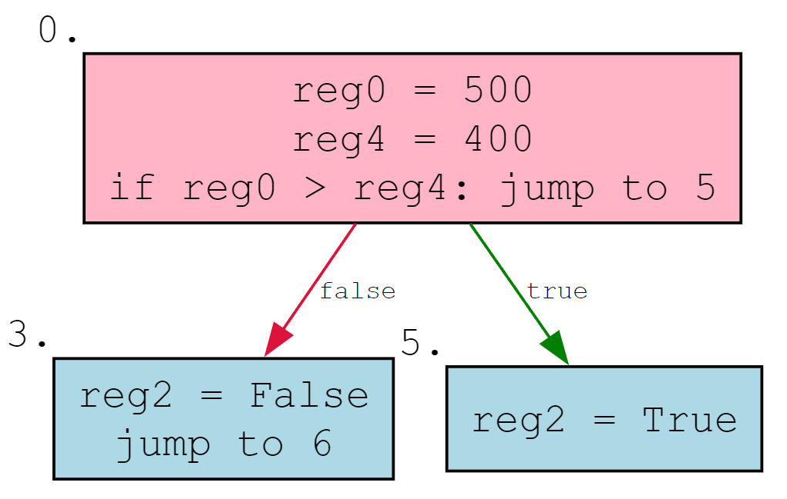

# Decompilation Notes

## Introduction

This document contains notes on what code patterns compile to in the HashLink bytecode. It is intended to be a reference both for the implementation of the crashlink decompiler and for anyone interested in reading and understanding HL opcodes.

## Registers

A register is a strictly typed single slot for data at runtime. Every function has a list of registers that it uses to store data - they store every value that is used in the function as a local. Register names can be inferred by the `assigns` debug field, which stores opcode indexes that correspond to assigning a variable.

## If Statements

Sample: `tests/haxe/If.hx`

In the case of an empty if statement:

```hx
var a = 500;
if (a > 400) {
    
}
```

The following is generated:



Presumably to avoid implementing additional logic for empty if statements, the result of the condition is always stored in a register, even if it is not used. This only applies to if statements with empty bodies.
